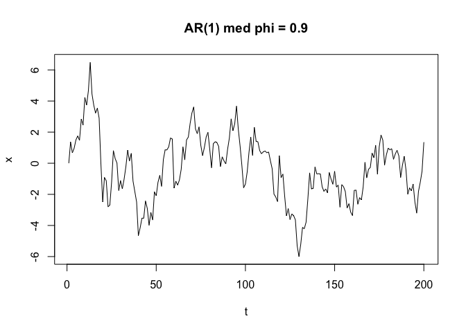

<!-- README.md is generated from README.Rmd. Please edit that file -->

# pedercplus

<!-- badges: start -->

[](https://lifecycle.r-lib.org/articles/stages.html#experimental)
[](https://github.com/pedersebastian/pedercplus/actions/workflows/R-CMD-check.yaml)
<!-- badges: end -->

En personlig lærlingepakke for å utforske C++ og Rcpp. Inneholder
implementasjoner av strengmanipulasjon og tidsserie-simulering, brukt
til å sammenligne ulike C++-tilnærminger og forstå når C++ gir
ytelsesfordeler over vanlig R.

## Installasjon

``` r
# install.packages("pak")
pak::pak("pedersebastian/pedercplus")
```

## Funksjoner

### `to_lower` — tre C++-varianter

Tre måter å konvertere en streng til små bokstaver på i C++:

``` r
library(pedercplus)

to_lower_v1("Hello World")  # std::transform
#> [1] "hello world"
to_lower_v2("Hello World")  # manuell loop med ASCII-aritmetikk
#> [1] "hello world"
to_lower_v3("Hello World")  # range-based for-loop
#> [1] "hello world"
```

### `ar1_cpp` — AR(1)-prosess

Simulerer en AR(1)-tidsserie. Fordi hvert steg avhenger av forrige kan
ikke R vektorisere dette — C++ gir derfor en reel ytelsesfordel her.

``` r
set.seed(42)
x <- ar1_cpp(n = 200, phi = 0.9, sigma = 1)
plot(x, type = "l", main = "AR(1) med phi = 0.9", ylab = "x", xlab = "t")
```


